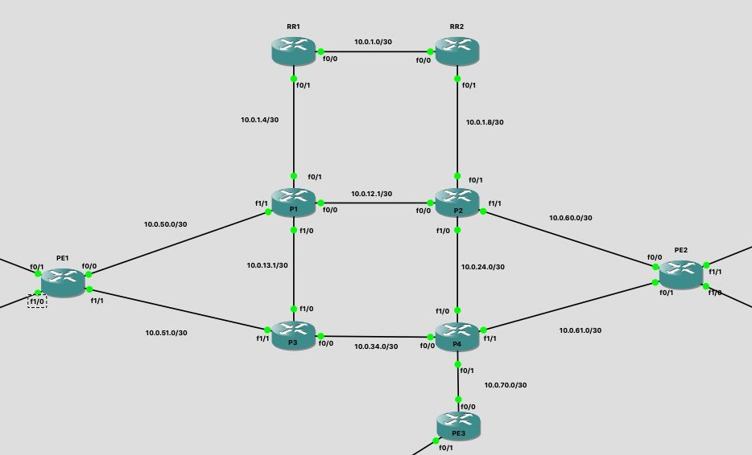
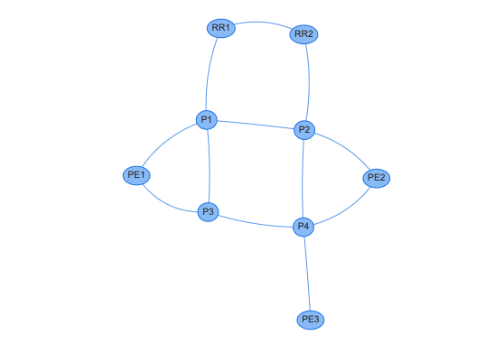

# Network Diagram Ansible Playbook

An Ansible playbook that takes the `net_neighbors` results from ansible facts and creates a network graph that shows the neighbor relations between the queried devices.

Uses Ansible to gather facts and execute tasks, a python script to format the facts output, and vis.js for the graph visualization.

Created and tested with Ansible 2.10.3, Python 3.7.3, GNS3, and Cisco 7200s running `c7200-adventerprisek9-mz.152-4`.

## Examples

The `sample_facts` directory contains the fact gathering for the following topology below.

Running `ansible-playbook generate_sample_diagram.yml` will process and format the data in `sample_facts`, generate a json file in the correct format for vis.js, and will build and launch the HTML file with a diagram like the one below.

The `generate_diagram.yml` playbook can be used to generate a diagram of your own network. This playbook will perform the fact gathering along with all of the steps above. An inventory file, which is not included in this repo, will need to be built in order to run this playbook against your own network.
